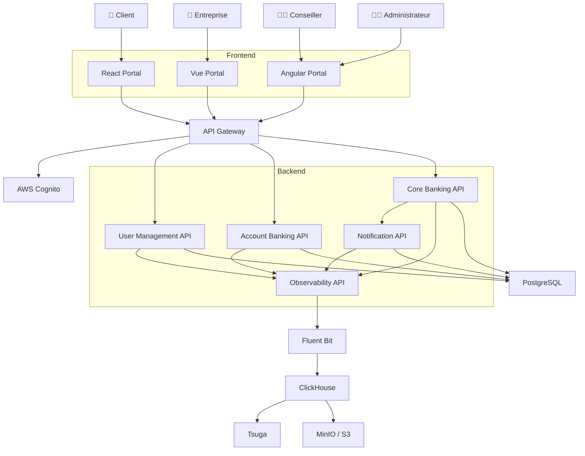
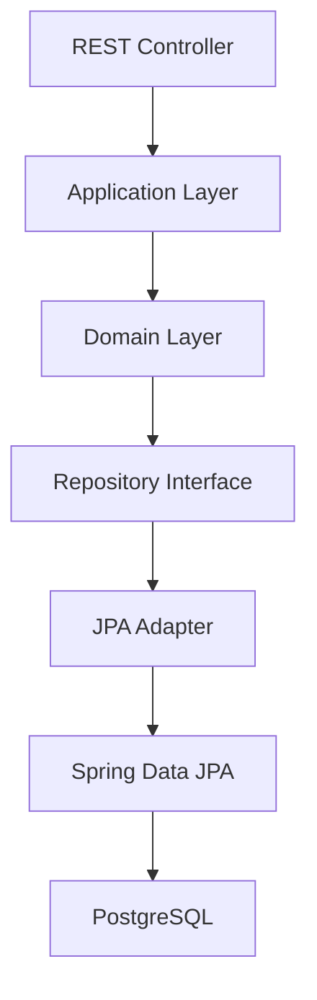
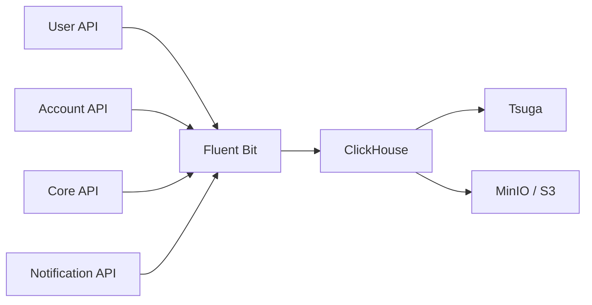
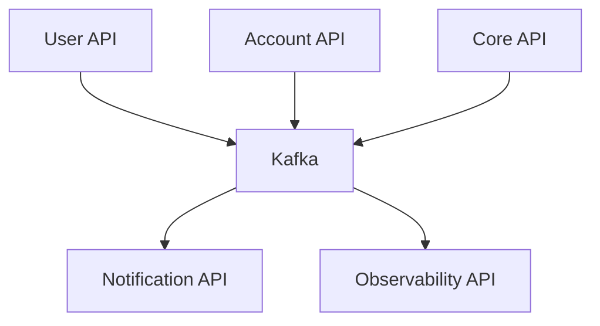

# Architecture Technique Globale

# Banking Simulation Platform

## 1. Vision du projet

La **Banking Simulation Platform** est une plateforme bancaire moderne développée dans un objectif pédagogique, architectural et démonstratif.

Elle permet de simuler le fonctionnement d'une banque de détail en mettant en œuvre :

- Architecture Microservices
- Domain Driven Design
- Clean Architecture
- Hexagonal Architecture
- Event Driven Architecture
- Observabilité avancée
- Cloud Native
- DevOps
- Infrastructure as Code

L'objectif est de démontrer une architecture proche des standards utilisés dans les banques et fintech modernes.

---

## 2. Couches d'architecture

```text
Frontend Layer
API Layer
Domain Layer
Persistence Layer
Observability Layer
DevOps Layer
```

---

## 3. Diagramme global



---

## 4. Architecture Frontend

La plateforme utilise une approche multi-frontends :

| Application | Technologie | Utilisateurs |
|---|---|---|
| Client Banking Portal | React, TypeScript, Vite | Clients particuliers |
| Business Banking Portal | Vue.js, TypeScript, Pinia | Entreprises |
| Advisor & Admin Portal | Angular, Angular Material, RxJS | Conseillers et administrateurs |

---

## 5. Architecture Backend

Le backend est organisé autour des APIs suivantes :

| API | Bounded Context | Responsabilités |
|---|---|---|
| API Gateway | Transverse | Routage, sécurité, logging |
| User Management API | Identity Context | Utilisateurs, rôles, entreprises |
| Account Banking API | Account Context | Comptes, IBAN, soldes, historique |
| Core Banking API | Banking + Approval Contexts | Dépôts, retraits, virements, validations |
| Notification API | Notification Context | Notifications, emails, templates |
| Observability API | Observability Context | Audit, logs, traces, métriques |

---

## 6. Architecture interne des APIs

Chaque API suit une architecture hexagonale.



Objectif : protéger le domaine métier des détails techniques.

---

## 7. Architecture Observabilité

L'observabilité est transverse et indépendante du métier.

Elle couvre :

- audit métier ;
- logs techniques ;
- traces distribuées ;
- métriques ;
- archivage long terme.



---

## 8. Architecture Event Driven

Kafka sera introduit à partir du MVP 2.



---

## 9. Sécurité

La sécurité cible repose sur :

- OAuth2 ;
- OpenID Connect ;
- JWT ;
- AWS Cognito ;
- RBAC.

Rôles :

```text
ROLE_CLIENT
ROLE_BUSINESS
ROLE_ADVISOR
ROLE_ADMIN
```

---

## 10. Technologies retenues

| Domaine | Technologies |
|---|---|
| Backend | Java 21, Spring Boot 3, Spring Security, Spring Data JPA, Flyway, OpenAPI |
| Frontend | React, Vue.js, Angular, TypeScript |
| Données | PostgreSQL, ClickHouse, MinIO |
| Observabilité | Fluent Bit, Tsuga |
| DevOps | Docker, Kubernetes, Terraform, GitHub Actions |

---

## 11. Objectif final

Construire une plateforme bancaire simulée capable de démontrer :

- DDD ;
- Architecture hexagonale ;
- microservices ;
- sécurité OAuth2/OIDC ;
- observabilité moderne ;
- cloud native ;
- CI/CD ;
- infrastructure as code.
