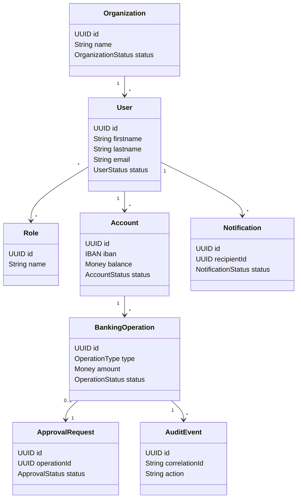

# Modèle de Domaine Métier DDD

# Banking Simulation Platform

## 1. Objectif

Ce document décrit le modèle de domaine métier de la plateforme selon une approche Domain Driven Design.

Il sert de référence pour :

- les APIs ;
- les entités métier ;
- les agrégats ;
- les règles métier ;
- les événements métier ;
- les tests.

---

## 2. Bounded Contexts

```text
Identity Context
Account Context
Banking Operation Context
Approval Context
Notification Context
Observability Context
```

---

## 3. Identity Context

Responsabilité : utilisateurs, rôles, permissions et organisations.

Agrégat principal : `User`.

Entités :

- User ;
- Role ;
- Permission ;
- Organization.

Règles :

- un utilisateur doit avoir au moins un rôle ;
- un utilisateur suspendu ne peut pas accéder à la plateforme ;
- une entreprise peut avoir plusieurs utilisateurs ;
- un administrateur peut gérer les rôles.

---

## 4. Account Context

Responsabilité : comptes bancaires, soldes, IBAN et statuts.

Agrégat principal : `Account`.

Entités :

- Account ;
- AccountBalance ;
- AccountOwner.

Objets valeur :

- IBAN ;
- Money ;
- Currency.

Règles :

- un compte appartient à un seul propriétaire ;
- seul un compte actif peut effectuer des opérations ;
- le solde ne doit jamais être modifié directement hors opération métier.

---

## 5. Banking Operation Context

Responsabilité : dépôts, retraits, virements, paiements instantanés et batchs.

Agrégat principal : `BankingOperation`.

Entités :

- Deposit ;
- Withdrawal ;
- Transfer ;
- BatchPayment ;
- BatchPaymentLine ;
- Transaction.

Objets valeur :

- Money ;
- Beneficiary ;
- OperationReference.

Règles :

- toute opération doit avoir un montant positif ;
- le compte émetteur doit être actif ;
- le solde doit être suffisant pour un retrait ou un virement ;
- une opération exécutée doit être historisée.

---

## 6. Approval Context

Responsabilité : demandes de validation des opérations sensibles.

Agrégat principal : `ApprovalRequest`.

Entités :

- ApprovalRequest ;
- ApprovalDecision ;
- ApprovalThreshold.

Règles :

- une demande est créée lorsqu'une opération dépasse un seuil ;
- un refus doit contenir un motif ;
- une décision est irréversible ;
- toute décision est auditée.

---

## 7. Notification Context

Responsabilité : notifications applicatives et emails.

Agrégat principal : `Notification`.

Entités :

- Notification ;
- EmailMessage ;
- NotificationTemplate ;
- NotificationPreference.

Règles :

- une notification est créée après chaque opération importante ;
- l'échec d'une notification ne bloque pas l'opération bancaire ;
- chaque notification est historisée.

---

## 8. Observability Context

Responsabilité : audits, logs, traces et métriques.

Agrégat principal : `AuditEvent`.

Entités :

- AuditEvent ;
- TraceEvent ;
- LogEvent ;
- MetricEvent.

Objets valeur :

- CorrelationId.

Règles :

- chaque appel API doit porter un correlationId ;
- chaque opération métier produit un audit ;
- l'observabilité ne doit pas bloquer le métier.

---

## 9. Événements métier

Identity events :

```text
UserCreated
UserSuspended
UserRoleChanged
OrganizationCreated
```

Account events :

```text
AccountCreated
AccountActivated
BalanceUpdated
AccountClosed
```

Banking events :

```text
DepositCreated
WithdrawalCreated
TransferCreated
TransferExecuted
TransferRejected
BatchPaymentCreated
```

Approval events :

```text
ApprovalRequested
OperationApproved
OperationRejected
```

Notification events :

```text
NotificationCreated
NotificationSent
NotificationFailed
```

---

## 10. Diagramme de domaine simplifié


