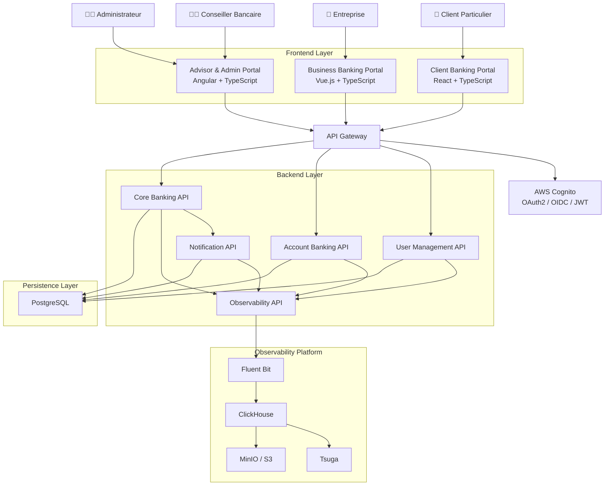
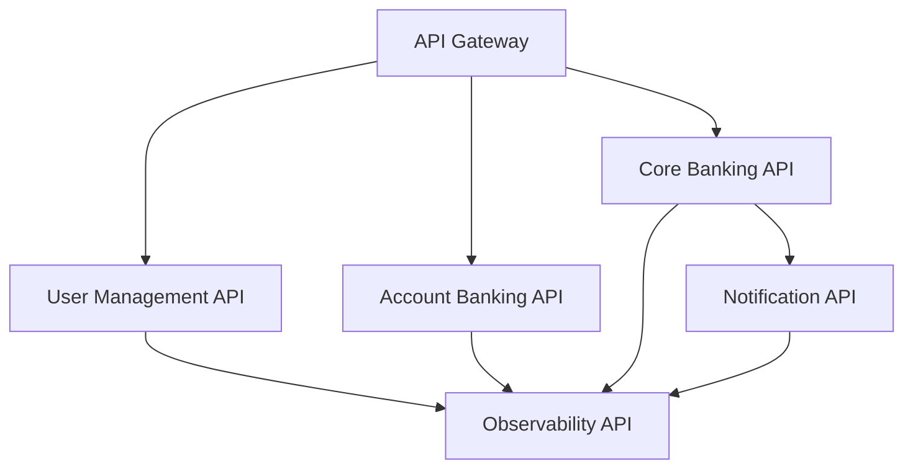
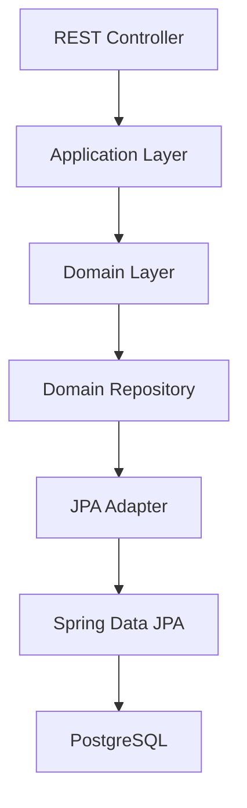
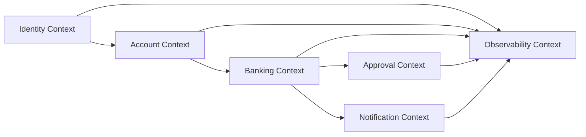
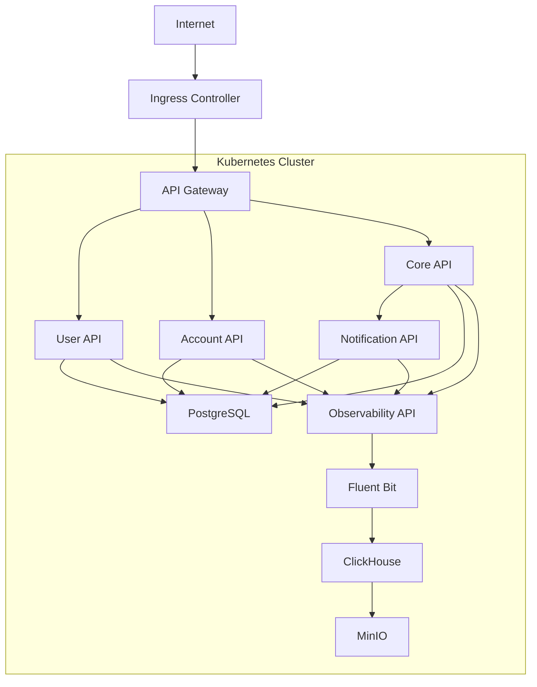

# Diagrammes d'Architecture

# Banking Simulation Platform

## 1. Diagramme global

---

## 2. Architecture des APIs

---

## 3. Architecture interne d'un microservice

---

## 4. Bounded Contexts DDD

---

## 5. Architecture Kubernetes cible

