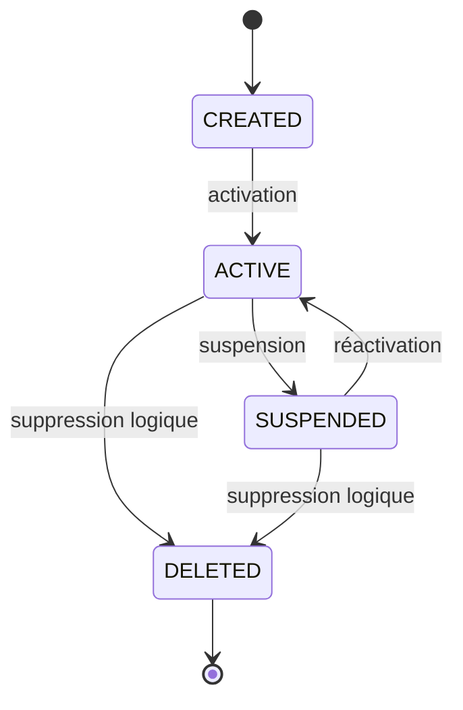
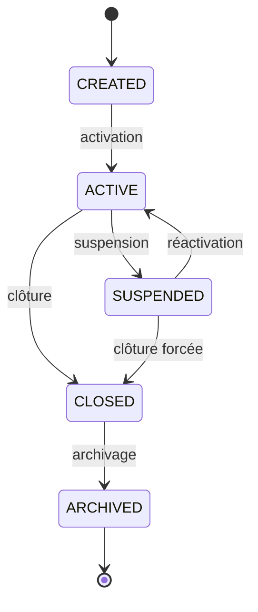
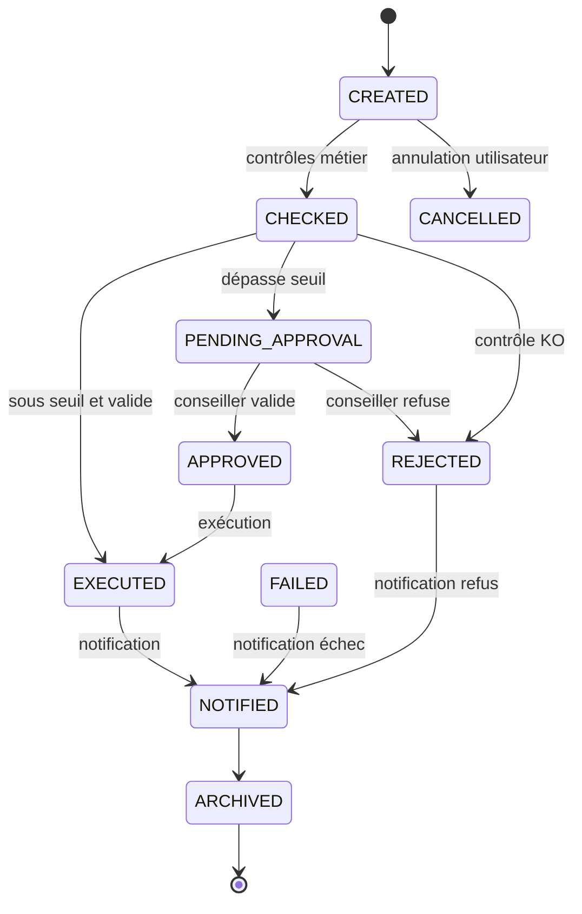
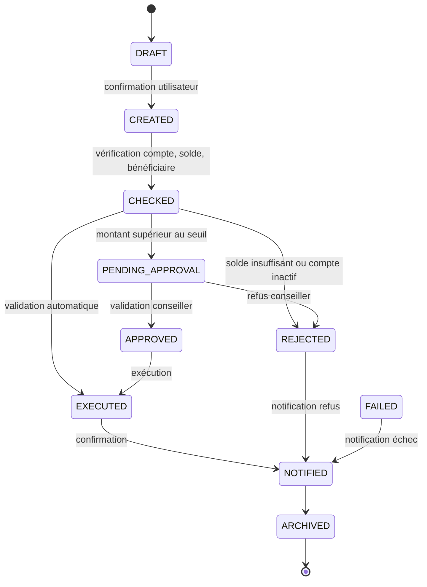
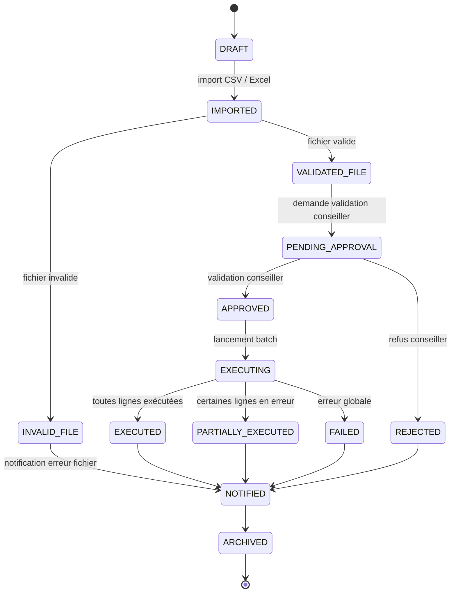
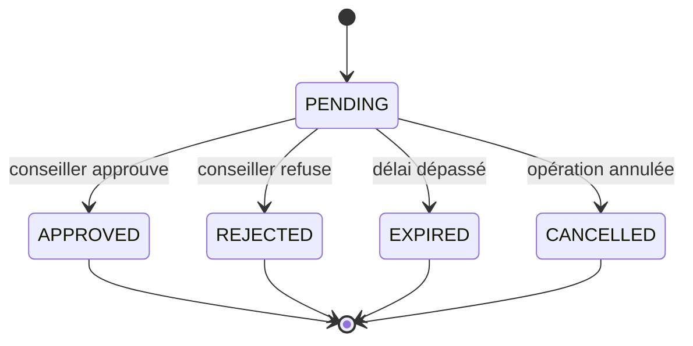
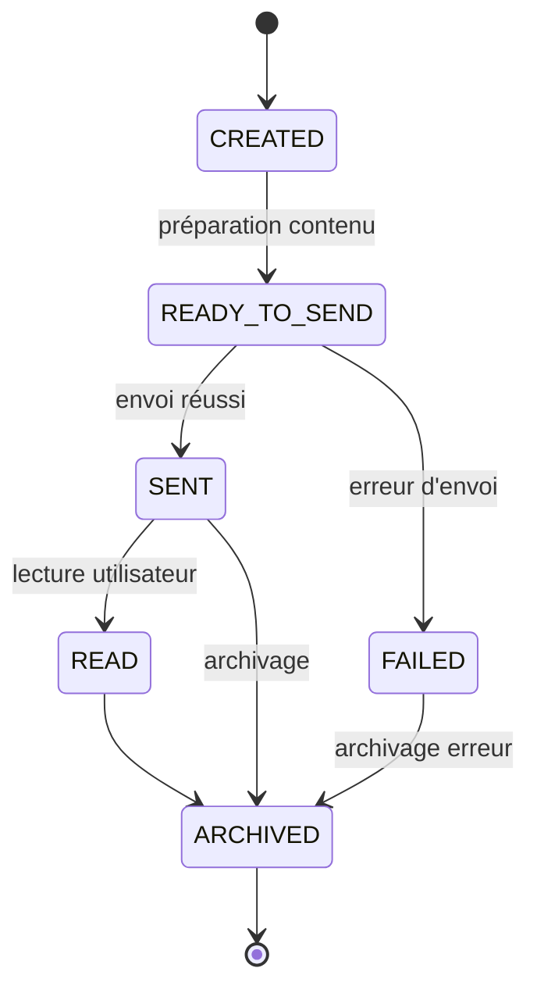

# États Métiers et State Machines

# Banking Simulation Platform

## 1. Objectif

Les state machines décrivent les états possibles des principaux objets métier et les transitions autorisées.

Elles servent à sécuriser :

- les règles métier ;
- les enums Java ;
- les contrôles fonctionnels ;
- les tests unitaires ;
- les tests d'intégration.

---

## 2. Cycle de vie d'un utilisateur

États :

```text
CREATED
ACTIVE
SUSPENDED
DELETED
```



Règles :

- un utilisateur suspendu ne peut pas effectuer d'opération ;
- une suppression est logique ;
- toute suspension est auditée.

---

## 3. Cycle de vie d'un compte bancaire

États :

```text
CREATED
ACTIVE
SUSPENDED
CLOSED
ARCHIVED
```



Règles :

- seul un compte actif peut effectuer des opérations ;
- un compte clôturé ne peut plus être réactivé ;
- toute clôture est historisée.

---

## 4. Cycle de vie d'une opération bancaire

États :

```text
CREATED
CHECKED
PENDING_APPROVAL
APPROVED
REJECTED
EXECUTED
FAILED
CANCELLED
NOTIFIED
ARCHIVED
```



Règles :

- une opération refusée ne peut pas être exécutée ;
- une opération exécutée ne revient jamais en attente ;
- tout refus doit contenir un motif ;
- toute opération doit produire un audit.

---

## 5. Cycle de vie d'un virement



---

## 6. Cycle de vie d'un multi-virement entreprise



---

## 7. Cycle de vie d'une demande de validation



---

## 8. Cycle de vie d'une notification



---

## 9. Synthèse

| Objet métier | États principaux |
|---|---|
| User | CREATED, ACTIVE, SUSPENDED, DELETED |
| Account | CREATED, ACTIVE, SUSPENDED, CLOSED, ARCHIVED |
| BankingOperation | CREATED, CHECKED, PENDING_APPROVAL, APPROVED, REJECTED, EXECUTED |
| Transfer | DRAFT, CREATED, CHECKED, PENDING_APPROVAL, EXECUTED |
| BatchPayment | DRAFT, IMPORTED, VALIDATED_FILE, PENDING_APPROVAL, EXECUTED |
| ApprovalRequest | PENDING, APPROVED, REJECTED, EXPIRED |
| Notification | CREATED, READY_TO_SEND, SENT, FAILED, READ |
