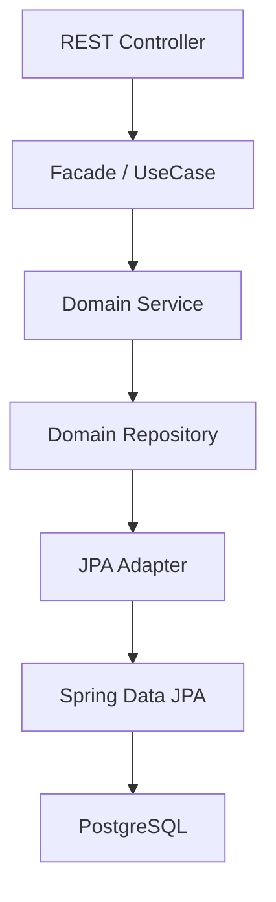

# Backend Coding Rules

# Banking Simulation Platform

## 1. Objectif

Ce document définit les règles de développement backend pour les APIs Spring Boot de la Banking Simulation Platform.

Il s'applique aux services suivants :

```text
api-gateway
user-management-api
account-banking-api
core-banking-api
notification-api
observability-api
```

Ces règles s'appuient sur les bonnes pratiques REST, API First, DDD, architecture hexagonale, sécurité, observabilité et maintenabilité.

Références principales :

- Microsoft Azure Architecture Center — RESTful Web API Design Best Practices
- Zalando RESTful API and Event Guidelines
- OWASP API Security Top 10
- NIST Secure Software Development Framework

---

## 2. Architecture obligatoire

Respect strict du flux suivant :

```text
Controller
  -> Facade / UseCase
  -> Service
  -> Repository métier
  -> JPA Adapter
  -> JpaRepository
  -> PostgreSQL
```

Diagramme :



Règles essentielles :

- le Controller ne contient jamais de logique métier ;
- le Controller reçoit des DTO request et retourne des DTO response ;
- la Facade ou le UseCase orchestre le cas d'usage ;
- le Service porte les règles métier ;
- le Service ne manipule pas directement les Entity JPA ;
- le Repository métier est une interface du domaine ;
- le JPA Adapter implémente le Repository métier ;
- le JpaRepository reste dans l'infrastructure ;
- les objets Domain sont séparés des Entity ;
- toute conversion passe par un Mapper.

---

## 3. Structure interne d'un service

Chaque microservice Spring Boot doit suivre cette structure :

```text
src/main/java/com/banking/<service>/
├── api/
│   ├── controller/
│   ├── request/
│   ├── response/
│   └── error/
├── application/
│   ├── facade/
│   ├── usecase/
│   ├── command/
│   └── query/
├── domain/
│   ├── model/
│   ├── valueobject/
│   ├── service/
│   ├── event/
│   └── repository/
├── infrastructure/
│   ├── persistence/
│   │   ├── entity/
│   │   ├── mapper/
│   │   ├── adapter/
│   │   └── jpa/
│   ├── security/
│   ├── client/
│   └── observability/
└── config/
```

Règle absolue :

```text
Le domaine ne dépend jamais de Spring, JPA, REST, Kafka ou d'un framework technique.
```

---

## 4. Nommage obligatoire

Pour chaque agrégat, respecter ce schéma :

```text
UserController
UserFacade
UserService
UserRepository
UserJpaAdapter
UserJpaRepository
UserEntity
UserMapper
```

Règles Java :

| Élément | Règle | Exemple |
|---|---|---|
| Package | lowercase | `com.banking.user.domain.model` |
| Classe | PascalCase | `UserService` |
| Interface | PascalCase | `UserRepository` |
| Méthode | camelCase | `createUser()` |
| Variable | camelCase | `userId` |
| Constante | UPPER_SNAKE_CASE | `MAX_TRANSFER_AMOUNT` |
| Enum | PascalCase | `UserStatus` |
| Valeur enum | UPPER_SNAKE_CASE | `ACTIVE` |

---

## 5. DTO

Un DTO par usage.

Exemples :

```text
CreateUserRequest
UpdateUserRequest
UserResponse
CreateAccountRequest
AccountResponse
CreateTransferRequest
TransferResponse
```

Règles :

- ne jamais exposer une Entity dans une réponse API ;
- ne jamais accepter une Entity en entrée API ;
- ne pas réutiliser un DTO de création pour une mise à jour ;
- les DTO request portent les annotations de validation syntaxique ;
- les DTO response ne contiennent que les données nécessaires au client.

---

## 6. Validation

Toutes les entrées API doivent être validées avec Bean Validation.

Annotations usuelles :

```text
@NotNull
@NotBlank
@Email
@Positive
@Size
```

Exemple :

```java
public record CreateUserRequest(
    @NotBlank String firstname,
    @NotBlank String lastname,
    @Email @NotBlank String email
) {}
```

Règles :

- les validations simples restent dans les DTO ;
- les règles métier fortes restent dans le domaine ;
- ne jamais se contenter des annotations pour une règle métier bancaire ;
- toute règle métier critique doit avoir un test unitaire.

---

## 7. REST API design

### 7.1 Ressources, pas actions

Bon :

```http
GET /users
POST /users
GET /users/{user_id}
POST /transfers
```

Mauvais :

```http
POST /create-user
POST /execute-transfer
GET /get-user-details
```

### 7.2 Collections au pluriel

```http
/users
/accounts
/transfers
/notifications
/audit-events
```

### 7.3 Chemins en kebab-case

```http
/approval-requests
/audit-events
/account-statements
```

### 7.4 Query parameters en snake_case

```http
GET /transfers?account_id=123&created_after=2026-01-01&status=EXECUTED
```

### 7.5 URLs peu profondes

Maximum recommandé : trois niveaux de sous-ressources.

---

## 8. Méthodes HTTP

| Méthode | Usage |
|---|---|
| GET | Lire une ressource ou collection |
| POST | Créer une ressource ou déclencher un traitement métier |
| PUT | Remplacer une ressource complète, idempotent |
| PATCH | Modifier partiellement une ressource |
| DELETE | Supprimer ou clôturer logiquement une ressource |

Règles :

- `GET` ne modifie jamais l'état serveur ;
- `PUT` doit être idempotent ;
- `DELETE` privilégie la suppression logique pour les données bancaires ;
- les traitements longs retournent `202 Accepted` avec un endpoint de suivi.

---

## 9. Codes HTTP standards

| Code | Usage |
|---|---|
| 200 OK | Lecture ou traitement réussi |
| 201 Created | Ressource créée |
| 202 Accepted | Traitement accepté mais non terminé |
| 204 No Content | Succès sans corps de réponse |
| 400 Bad Request | Requête invalide |
| 401 Unauthorized | Authentification absente ou invalide |
| 403 Forbidden | Authentifié mais non autorisé |
| 404 Not Found | Ressource inexistante |
| 409 Conflict | Conflit métier ou état incompatible |
| 415 Unsupported Media Type | Format non supporté |
| 422 Unprocessable Entity | Règle métier non respectée |
| 429 Too Many Requests | Rate limit atteint |
| 500 Internal Server Error | Erreur technique non prévue |

---

## 10. Format d'erreur unique

La gestion des erreurs est centralisée avec `@ControllerAdvice`.

Format :

```json
{
  "code": "ACCOUNT_NOT_ACTIVE",
  "message": "Le compte n'est pas actif",
  "timestamp": "2026-06-20T10:15:30Z",
  "correlationId": "cor_123456"
}
```

Règles :

- ne jamais exposer de stack trace au client ;
- retourner un code fonctionnel stable ;
- retourner un `correlationId` ;
- documenter les erreurs dans OpenAPI ;
- distinguer erreur technique et erreur métier.

---

## 11. Pagination, tri et filtrage

Toutes les listes doivent être paginées.

Exemple :

```http
GET /transactions?account_id=acc_123&limit=25&offset=0&sort=-created_at
```

Règles :

- valeur par défaut pour `limit` ;
- limite maximale imposée ;
- filtrage explicite ;
- tri via `sort` ;
- pagination par curseur possible dans une version avancée.

---

## 12. Idempotence

Les opérations financières doivent supporter l'idempotence.

Header recommandé :

```http
Idempotency-Key: 0f6f3e64-62b7-4e2c-a4b6-4f51d3f7a900
```

À appliquer sur :

- dépôts ;
- retraits ;
- virements ;
- paiements instantanés ;
- multi-virements ;
- validations sensibles.

Règle :

```text
Une même requête avec la même Idempotency-Key ne doit pas produire deux opérations financières.
```

---

## 13. Security rules essentielles

### 13.1 Authentification

- toutes les APIs sont protégées par JWT / OAuth2 / OIDC ;
- aucun endpoint métier ne doit être public ;
- les tokens sont validés côté API Gateway et côté service sensible ;
- HTTPS obligatoire en environnement exposé.

### 13.2 Autorisation

Contrôle par rôle :

```text
ROLE_CLIENT
ROLE_BUSINESS
ROLE_ADVISOR
ROLE_ADMIN
```

Règles :

- vérifier l'accès à chaque ressource par propriétaire ;
- un client ne peut jamais consulter un compte qui ne lui appartient pas ;
- les contrôles d'autorisation ne doivent jamais reposer seulement sur le frontend ;
- les endpoints advisor/admin nécessitent un rôle dédié.

### 13.3 Données sensibles

Ne jamais journaliser :

- mot de passe ;
- token d'accès ;
- token de renouvellement ;
- numéro complet de carte ;
- données personnelles sensibles.

Règles :

- masquer les IBAN et identifiants sensibles dans les journaux ;
- ne jamais retourner de secret dans une réponse API ;
- limiter les données retournées au strict nécessaire.

### 13.4 Secrets

- aucun secret dans GitHub ;
- utiliser variables d'environnement, Kubernetes Secrets ou Vault ;
- prévoir une rotation des secrets ;
- séparer les secrets par environnement.

### 13.5 Protection API

- rate limiting obligatoire ;
- pagination obligatoire sur les listes ;
- taille maximale des payloads ;
- timeout sur appels inter-services ;
- protection contre injection SQL via JPA et requêtes paramétrées ;
- protection contre mass assignment : ne jamais binder directement un DTO non contrôlé vers une entité.

---

## 14. Audit

Chaque opération sensible doit produire un audit :

```text
connexion
création compte
dépôt
retrait
virement
validation conseiller
refus conseiller
action admin
```

Champs minimaux :

```json
{
  "timestamp": "2026-06-20T10:15:30Z",
  "service": "core-banking-api",
  "correlationId": "cor_123456",
  "userId": "usr_123456",
  "action": "TRANSFER_CREATED",
  "result": "SUCCESS"
}
```

---

## 15. Transactions

Règles :

- transaction applicative au niveau Facade / UseCase ;
- pas de transaction ouverte dans les controllers ;
- pas de logique métier dans les repositories ;
- une opération financière doit être atomique ;
- les événements externes sont publiés après validation de la transaction.

---

## 16. Tests backend

Règles :

- test unitaire obligatoire pour chaque règle métier ;
- test d'intégration pour chaque endpoint critique ;
- Testcontainers pour PostgreSQL, Kafka et ClickHouse ;
- aucun merge sans tests verts.

Outils :

```text
JUnit 5
Mockito
AssertJ
Testcontainers
Spring Boot Test
REST Assured
```

---

## 17. CI/CD sécurité

Le pipeline doit prévoir :

- scan dépendances ;
- scan image Docker ;
- analyse statique ;
- exécution des tests ;
- blocage merge si vulnérabilité critique ;
- branch protection sur `main`.

Règle :

```text
La sécurité est intégrée dans tout le cycle de développement, pas seulement en fin de projet.
```

---

## 18. Checklist backend avant merge

- [ ] Architecture Controller -> Facade -> Service -> Repository -> Adapter respectée.
- [ ] Le Controller ne contient pas de logique métier.
- [ ] Le Service ne manipule pas d'Entity JPA.
- [ ] Les DTO sont dédiés par usage.
- [ ] Les entrées API sont validées.
- [ ] Les erreurs passent par `@ControllerAdvice`.
- [ ] Les règles métier sont testées.
- [ ] Les endpoints critiques ont des tests d'intégration.
- [ ] Les données sensibles ne sont pas journalisées.
- [ ] Le correlationId est présent.
- [ ] Les endpoints métier sont sécurisés.
- [ ] Le pipeline CI est vert.
